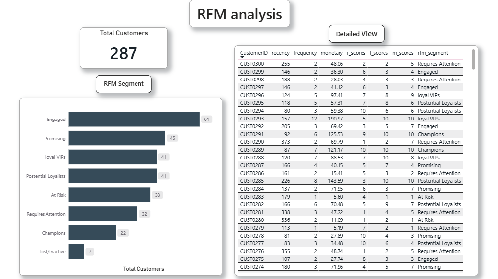

# 📊 RFM Analysis Project

## 🚀 Overview

This project performs **customer segmentation using RFM (Recency, Frequency, Monetary) analysis** to identify high-value customers and improve business decision-making.

The entire pipeline includes **data processing in Google BigQuery** and **interactive dashboard creation in Power BI**.

---

## 🛠️ Tools & Technologies

* **Google BigQuery (SQL)**
* **Power BI**
* **Git & GitHub**

---

## 📂 Project Structure

```
rfm-analysis-project/
│
├── dataset/              # Sample dataset
├── images/               # Dashboard screenshots
├── sql/
│   └── rfm_analysis.sql  # SQL script
├── powerbi/
│   └── rfm_dashboard.pbix
└── README.md
```

---

## ⚙️ Methodology

### 1️⃣ Data Preparation

* Combined 12 months of sales data using `UNION ALL`

### 2️⃣ RFM Calculation

* **Recency** → Days since last purchase
* **Frequency** → Number of purchases
* **Monetary** → Total spending

### 3️⃣ Scoring

* Used `NTILE(10)` to assign scores (1–10)

### 4️⃣ Segmentation

Customers are grouped into:

* Champions
* Loyal VIPs
* Potential Loyalists
* Promising
* Engaged
* Requires Attention
* At Risk
* Lost / Inactive

---

## 📊 Dashboard Preview



---

## 🔍 Key Insights

* Majority of customers fall under **Engaged & Promising segments**
* Very few customers qualify as **Champions**


---

## 📌 Conclusion

This project demonstrates an **end-to-end data analysis workflow**, from raw data processing to business insights using RFM segmentation.

---

## 👨‍💻 Author

**Mayur Makvana**
